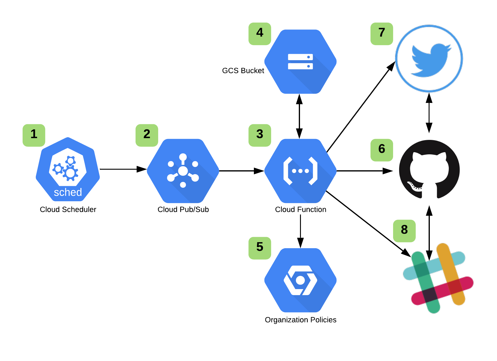

# GCP Organization Policy Notifier

## Description

This is a 100% serverless tool that analyzes [GCP Organization Policies](https://cloud.google.com/resource-manager/docs/organization-policy/overview) for updates and will post to a slack channel as well as twitter via the twitter bot <insert twitter bot handle>. We created this tool after being surprised by new Organization Policies in our console without a notification they were added and available. 

## Process Flow



1. A Cloud Scheduler job kicks off at 9 AM ET every day and sends a message to Cloud Pub/Sub.
2. Cloud Pub/Sub has a subscription that triggers a Cloud Function and forwards the message from Cloud Scheduler.
3. A Cloud Function starts by analyzing the Cloud Scheduler message.
4. The Cloud Function searches for a pre-existing Organization Policy Constraint baseline file. 
- If one exists - it copies the file locally for comparison. 
- If one does not exist - it creates a baseline based on that day's available Organization Policy Constraints and then exists gracefully. 
5. With the baseline copied locally, the Cloud Function queries the available Organization Policy Constraints and does a comparison. If there are updates, the new Organization Policy Constraint list that was generated becomes the new baseline and is updated to the GCS bucket for future comparisons. The Cloud Function then moves on to steps 6 and 7.
6. The Cloud Function posts to Twitter via the handle @<<insert twitter handle>> and includes the new constraints.
7. In addition to a Twitter post, the Cloud Function will post in a Slack Channel alerting the participants of the available constraints.

## Configuration

1. Update or comment out the `backend.tf` file for the terraform state file.
```
terraform {
  backend "gcs" {
    bucket = "<insert_value_here>"
    prefix = "<insert_value_here>"
  }
}
```

2. In order to keep secrets out of the Terraform state file, we recommend manually uploading the [Slack Webhook](https://api.slack.com/messaging/webhooks) into GCP Secrets Manager and then referencing that in the below terraform variables.

3. Fill in the required values for the `terraform.tfvars` file. We recommend an isolated project for this solution as well as a separate GCS bucket for your policy file and the function's code file `src.zip`
```
function_name   = ""
region          = ""
topic_name      = ""
job_name        = ""
project_id      = ""
policy_bucket   = ""
file_location   = ""
policy_file     = ""
org_id          = ""
function_bucket = ""
secret_project  = ""
secret_name     = ""
secret_version  = ""
```

## Deployment

1. Clone the repository locally:
```
git clone git@github.com:ScaleSec/gcp_org_policy_notifier.git
```

2. Create your virtual environment:
```
python3 -m venv my_venv
```

3. Activate environment and install dependencies:
```
source my_venv/bin/activate
pip -r install src/requirements.txt
```

4. Deploy via terraform:
```
terraform init
terraform plan 
terraform apply
```

## Inputs

| Name | Description | Type | Default | Required |
|------|-------------|------|---------|:--------:|
| bucket\_force\_destroy | When deleting the GCS bucket containing the cloud function, delete all objects in the bucket first. | `bool` | `true` | no |
| file\_location | Location to store the org policy file in the Cloud Function. Needs to be in /tmp/. | `string` | n/a | yes |
| function\_available\_memory\_mb | The amount of memory in megabytes allotted for the function to use. | `number` | `2048` | no |
| function\_bucket | The GCS bucket that stores the Cloud Function. | `string` | n/a | yes |
| function\_description | The description of the function. | `string` | `"Compares Org Policies and alerts users."` | no |
| function\_entry\_point | The name of a method in the function source which will be invoked when the function is executed. | `string` | `"announce_kickoff"` | no |
| function\_event\_trigger\_failure\_policy\_retry | A toggle to determine if the function should be retried on failure. | `bool` | `false` | no |
| function\_name | The name to apply to the function. | `string` | n/a | yes |
| function\_perms | The Cloud Function custom IAM role permissions. Must be a list. | `list` | <pre>[<br>  "secretmanager.secrets.get",<br>  "secretmanager.versions.get",<br>  "secretmanager.versions.access",<br>  "orgpolicy.policy.get",<br>  "resourcemanager.projects.get",<br>  "resourcemanager.projects.list",<br>  "storage.objects.create",<br>  "storage.objects.get",<br>  "storage.objects.update",<br>  "storage.objects.delete",<br>  "storage.objects.list"<br>]</pre> | no |
| function\_runtime | The runtime in which the function will be executed. | `string` | `"python37"` | no |
| function\_source\_directory | The contents of this directory will be archived and used as the function source. | `string` | `"./src"` | no |
| function\_timeout\_s | The amount of time in seconds allotted for the execution of the function. | `number` | `60` | no |
| job\_description | The description of the Cloud Scheduler. | `string` | `"Starts Organization Policies check."` | no |
| job\_name | The name of the scheduled job to run. | `string` | n/a | yes |
| job\_schedule | The job frequency, in cron syntax. | `string` | `"0 9 * * *"` | no |
| message\_data | The data to send in the topic message. | `string` | `"U3RhcnRpbmcgQ29tcGFyaXNvbg=="` | no |
| org\_id | The GCP Org ID to assign permissions to. | `any` | n/a | yes |
| policy\_bucket | The GCS bucket that contains the Org policies. | `string` | n/a | yes |
| policy\_file | The name of the Org policy file in the GCS bucket. | `string` | n/a | yes |
| project\_id | The ID of the project where the resources will be created. | `string` | n/a | yes |
| region | The region in which resources will be applied. | `string` | n/a | yes |
| scheduler\_job | An existing Cloud Scheduler job instance. | `object({ name = string })` | `null` | no |
| secret\_name | The name of the Slack Webhook secret in GCP. | `any` | n/a | yes |
| secret\_project | The GCP project the Slack Webhook is stored. | `any` | n/a | yes |
| secret\_version | The version of the Slack Webhook secret in GCP. | `any` | n/a | yes |
| time\_zone | The timezone to use in scheduler. | `string` | `"America/Detroit"` | no |
| topic\_name | Name of pubsub topic connecting the scheduled job and the function. | `string` | n/a | yes |
